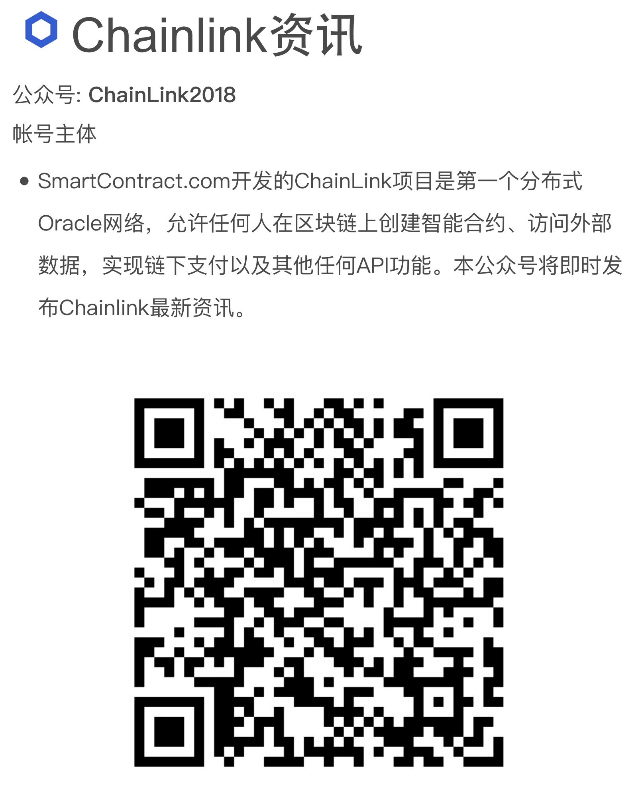

# Awesome Chainlink CN 

> 这里是优秀的中文Chainlink资料站，英文版的[在此](https://github.com/JohannEid/awesome-chainlink)

[Chainlink](https://chain.link)是一个去中心化的预言机网络网络，使智能合约可以安全地与外部数据源、事件和支付方式对接。Chainlink提供了复杂的智能合约所需的重要的链下信息，是数字协议的主要形式。

## 内容

<!-- TOC -->
[toc]

## 中文社区

 - 微信客服

 

 添加Chainlink微信官方客服账号，答对题目，即可加入Chainlink微信群。

 - 微信公众号

 

 - QQ群: 6135525 

 - [微博](https://weibo.com/chainlinkofficial)

 - [币乎](https://bihu.com/people/1869894547) - 每日更新Chainlink最新动态与技术分享

 - 合作联系<mailto:china@smartcontract.com>

 - [GitHub](https://github.com/smartcontractkit/chainlink)

 - [Gitter](https://gitter.im/smartcontractkit-chainlink/Lobby)

 - [推特](https://twitter.com/chainlinkofficial)

 - [电报](https://t.me/chainlinkofficial)

 - [Discord](https://discordapp.com/invite/rCUqTAC)

## 白皮书

 - [ChainLink A Decentralized Oracle Network](https://link.smartcontract.com/whitepaper) - Chainlink: 一个去中心化的预言机网络

 - [中文白皮书](https://github.com/JohannEid/Chainlink_Chinese_Whitepaper/blob/master/Chainlink-%E4%B8%AD%E6%96%87%E7%99%BD%E7%9A%AE%E4%B9%A6.pdf)

 - [Mixicles: Simple Private Decentralized Finance](https://chain.link/mixicles.pdf) - Mixcles: 去中心化金融的隐私保护

 ## PPT介绍

[Chainlink Presentation (CN)](https://chain.link/presentations/chinese.pdf)

## 开发文档

 - [英文开发文档](https://docs.chain.link/docs)

 - [中文开发文档](https://chainlink-chinese.readme.io/docs/%E6%AC%A2%E8%BF%8E%E4%BD%BF%E7%94%A8chainlink)

 *中文文档更新略落后于英文文档, 如果两者有不一致的情况时, 请以英文文档为准, 并联系我们更新*

