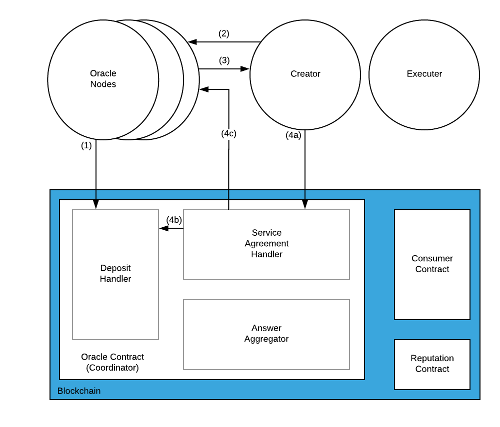
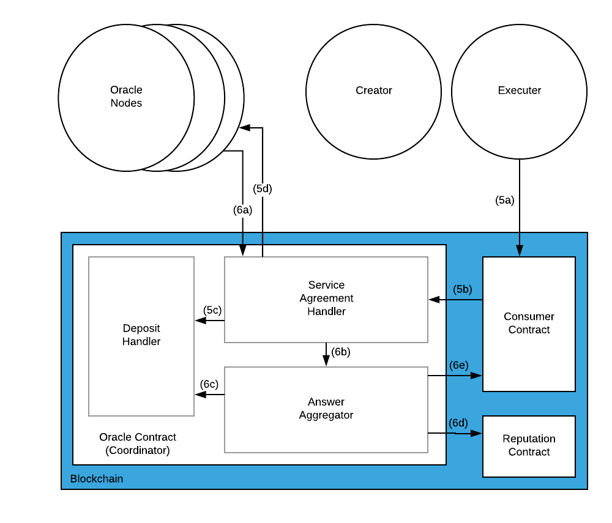
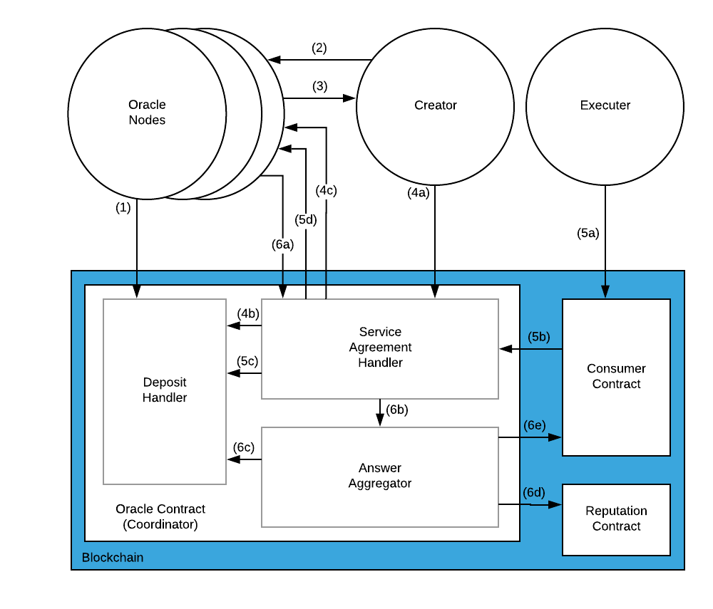

# Chainlink服务协议

# 启动

1. 预言机节点通过在“存款合约”中存入LINK进行注册。
    - 预言机节点通过以下参数调用预言机合约中的Deposit方法：
        - LINK数量

# 服务协议创建

2. CreateServiceAgreement(服务协议提议)请求者将服务协议提议发送到它选择的每个向它提供数据的预言机节点。

- 请求者在每个Oracle节点的API上调用CreateServiceAgreement：
    - 全部ServiceAgreement（见下文）
    - 覆盖SAID的签名（服务协议参数的哈希）

3. 每个选定的预言机节点都接受服务协议提议。预言机节点对已编码的服务协议（即SAID）的哈希进行签名，并将其签名返回给请求者。如果预言机节点无法执行服务协议，或选择不执行服务协议（例如抵押保证金不足），则它们会发送NACK，而请求者将使用一组新的预言机节点重新开始。

- 预言机节点响应请求者以下内容：
    - 覆盖SAID的签名

4. 请求者将带有所有预言机节点签名的服务协议提交到预言机合约。如果所有服务协议参数均有效（有关每个参数的有效性，请参见“保留参数”部分），并且预言机节点签名是覆盖SAID的有效签名，其顺序与预言机列表相同，如此服务协议便被记录下来，并且每个预言机节点都可按照服务协议中规定的金额来取回自己多余的抵押保证金。

- 请求者通过以下方式调用预言机合约中的InititiateServiceAgreement方法：
    - 服务协议的ABI
    - 预言机节点签名列表，按服务协议中列出的顺序排序。
- 请求处理程序（Request Handler）根据服务协议减免每个预言机的可提取保证金。

# 服务协议执行

5. 请求者指示预言机节点根据作业规范（Job Specification）创建运行任务（Run）。（a）此请求可以直接发送到预言机合约，也可以通过消费者合约进行路由。我们认为，通过消费者合约将会更加普遍，因此在这里展示的就是这种情况。

- 请求者通过以下方式调用消费者合约上的ExecuteServiceAgreement：
    - SAID
    - 该请求作业（Run Request）的参数
- 消费者合约使用以下命令在预言机合约上调用RequestRun：
    - SAID
    - 该运行请求的参数
    - 回调地址
    - 回调函数选择器
- 预言机合约发布了运行日志（Run Log）（一种特定的Solidity事件日志），其中包含：
    - 请求编号
    - SAID
    - 该请求作业（Run Request）的参数

6. 预言机节点们报告他们的答案并将其汇总在一起。如果所有预言机节点都在到期时间之前报告，最后一个报告答案的节点支付聚合事务的gas费用和清算抵押保证金。如果不是所有的预言机节点都在到期时间之前报告答案，则任何帐户都可以通知预言机合约以关闭请求。保证金将退还至参与/响应预言机节点。未响应的预言机节点的抵押金在请求者和发送关闭交易的帐户之间分配（待定：如何分配抵押金）。预言机合约将最终报告的答案发送给消费者合约。 

- 每个预言机节点使用以下命令调用预言机合约上的Fulfill方法：
    - 请求编号
    - 他们的回应
- 预言机将所有响应传递到其指定的聚合函数。答案汇总者（Answer Aggregator）确定所有参与和未参与的节点。
    - 如果没有足够的节点响应，则参与节点将收到其付款，而未参与的节点将损失部分抵押金以及损失声誉。
- 答案汇总者将参与/不参与节点报告给存款处理程序以进行财务处罚。
- 答案汇总者报告参与/不参与节点的声誉损失。
- 答案汇总者向消费者合约报告最终的结果。

# 服务协议

指定请求工作的细节。它分为两部分，链下作业规范（Job Spec）和链上保留限制（Encumbrance）。服务协议是可以在链上强制执行的工作规范参数的子集；例如保证金金额，预言机抵押金额，预言机列表等。

为了可靠地引用智能合约，可以使用任何JSON数据发送给服务协议，但始终由预言机节点对其进行规范化，以创建要使用的确定性JSON字符串。使用确定函数（deterministic function）可以使预言机节点同意彼此之间进行同一工作而无需直接进行通信。规范化处理JSON键排序，字符编码，浮点表示等。

为了强制执行服务协议，并确保所有预言机节点都对相同的数据进行操作，预言机通过ABI编码并签署ABI编码的哈希值将其提交给服务协议。ABI编码的服务协议的哈希称为SAID。

# 作业规范

作业规范（Job Spec）是每个预言机节点执行和报告结果的一系列步骤；例如httpGet，jsonParse，ethTx。Job Spec是用于特定的工作调用（也称为Job Runs）的模板，可以具有唯一的参数。例如URL，jsonPath，格式。

# 保留参数

保留参数是协议中可以在链上强制规定的部分。

当前的保留参数列表：

- Request Payment Amount 请求的支付金额：每个请求向每个预言机支付的金额
- Oracle Staked Amount 预言机抵押金额：每个预言机期望要提交的金额
- Minimum responses 最小响应：为了使答案有效返回给消费者合约至少所需要响应的节点数
- Submitted By 提交截止：服务协议在链上被确认的截止日期
- Request Expiration Time 请求到期时间：提交运行请求后，预言机节点必须响应的时间
- Aggregating Function 聚合功能：指定预期返回的数据类型
- End At 结束于：提交请求作业（Run Request）的截止日期
- Oracle Addresses 预言机地址：参与作业规范的所有预言机节点的列表
- Requester 请求者：通过签署SAID进行验证，在签署并进行链上之前由预言机进行检查。该字段可防止SAID之间的意外冲突。
- Hash of Service Agreement Body 服务协议正文的哈希：标准化服务协议JSON的哈希。为预言机节点提供保证，使它们都在相同数据上运行。

# 服务协议ID(SAID)

    hash(abi.encode(encumbranceParams... requester, hash(normalized(JobSpecJSON))))

完整的编码已提交给预言机合约。预言机合约检查所有参数的有效性（有关每个参数的有效性定义，请参见保留参数中的定义），然后对它们进行哈希处理以获得规范ID。然后，它将检查预言机节点的所有签名，以确保服务协议中列出的所有预言机都已确实同意服务协议。

# 保证金合约

保证金合约具有相应的管理合约，在本例中为预言机合约。保证金合约跟踪任何帐户的可提取余额（Withdrawable Balance）。任何帐户都可以使用LINK调用`Deposit()`，并且LINK的金额会记入该帐户的可提取余额中。当该帐户调用`Withdraw(n)`时，他们可以提款直至最大可提取余额。管理合约可以增加或减少可提取余额。

在最简单的情况下，当一个请求被预言机接受时，其可提取余额就会减少。完成请求后，它就会增加。将来可以添加更多的奖励和惩罚。

为简单起见，上图显示了每个请求的抵押金锁定。另外，为了激励预言机们在整个任务生命周期内坚持不懈，我们可能会为任务设置打开和关闭添加额外的存款锁定阶段。

# 罚金抵押Penalty Deposits

来自[白皮书](https://link.smartcontract.com/whitepaper)：

> *罚金抵押*：如果设定保证进抵押以确保节点运营商的表现，结果将是预言机提供者承诺不进行“退出诈骗（exit scam）”攻击的财务指标，在这种情况下，提供者会收取用户的钱，而不会提供服务。（*译注：即收钱不办事*）该度量将涉及时间和财务方面。

基本功能：

- **存入**：节点向协调器合约存入一定数量的LINK
- **锁定**：当接受需要罚款的服务协议时，该金额将被锁定，从而无法提取
- **解锁**：当需要罚款的服务协议终止时，该金额将被解锁，从而可以提取
- **提取**：节点从预言机合约中提取所以未锁定的LINK

# 存款

存入LINK需要少量的gas来支付交易费用。您的节点上的以太坊地址将需要提供资金才能成功进行存款交易。

# 提取

您可以随时撤回目前未锁定在服务协议中的LINK。重申，您在节点上的以太坊地址将支付交易费用。

# 示例场景

场景中使用的其他操作：

- Require 要求：请求者可能要求锁定指定数量的LINK，作为请求的保证金
- Ends 结束：服务协议在其到期时结束，解除了先前需要的LINK押金

## 场景A: 节点符合押金要求

1. NodeA将100 LINK存入协调者合约

`NodeA -(Deposit 100 LINK)> Coordinator`

*余额：总计100，罚款0，可提款100*

2. 创建SA1，要求每个节点锁定10个LINK作为罚款抵押

`SA1 -(Require 10 LINK)> Coordinator`

3. 节点A接受

`NodeA -(Lock 10 LINK)> Coordinator`

*余额：总计100，罚款10，可提款90*

4. SA1结束

`Coordinator -(Unlock 10 LINK)> NodeA`

*余额：总计100，罚款0，可提款100*

## 场景B: 节点不进行存款保证

1. 节点A没有向协调器合约存入LINK
2. 创建SA1，要求每个节点锁定10个LINK作为罚款抵押

`SA1 -(Require 10 LINK)> Coordinator`

3. 节点A不接受

## 场景C: 节点无法满足存款要求第1部分

1. 节点A将100 LINK存入协调者合约

`NodeA -(Deposit 100 LINK)> Coordinator` 

*余额：总计100，罚款0，可提款100*

2. 创建SA1，要求每个节点锁定110 LINK作为罚款抵押

`SA1 -(Require 110 LINK)> Coordinator`

3. 节点A不接受

## 场景D：节点无法满足存款要求第2部分

1. NodeA将100 LINK存入协调者合约

`NodeA -(Deposit 100 LINK)> Coordinator` 

*余额：总计100，罚款0，可提款100*

2. 创建SA1，要求每个节点锁定110 LINK作为罚款抵押

`SA1 -(Require 110 LINK)> Coordinator`

3. 节点A接受

`NodeA -(Lock 100 LINK)> Coordinator`

*余额：总计100，罚款100，可提款0*

4. 创建SA2，要求每个节点锁定10个LINK作为罚款抵押

`SA2 -(Require 10 LINK)> Coordinator`

5. 节点A不能接受SA2

6. SA1结束

`Coordinator -(Unlock 100 LINK)> NodeA`

*余额：总计100，罚款0，可提款100*

## 场景E：节点满足多种存款要求

1. NodeA将100 LINK存入协调者合约

`NodeA -(Deposit 100 LINK)> Coordinator` 

*余额：总计100，罚款0，可提款100*

2. 创建SA1，要求每个节点锁定110 LINK作为罚款抵押

`SA1 -(Require 110 LINK)> Coordinator`

3. 节点A接受SA1

`NodeA -(Lock 50 LINK)> Coordinator`

*余额：总计100，罚款50，可提款50*

4. 创建SA2，要求每个节点锁定40个LINK作为罚款抵押

`SA2 -(Require 40 LINK)> Coordinator`

5. 节点A接受SA2

`NodeA -(Lock 40 LINK)> Coordinator`

*余额：总计100，罚款90，可提款10*

6. SA1结束

`Coordinator -(Unlock 50 LINK)> NodeA`

*余额：总计100，罚款40，可提款50*

7. SA2结束

`Coordinator -(Unlock 40 LINK)> NodeA`

*余额：总计100，罚款0，可提款100*