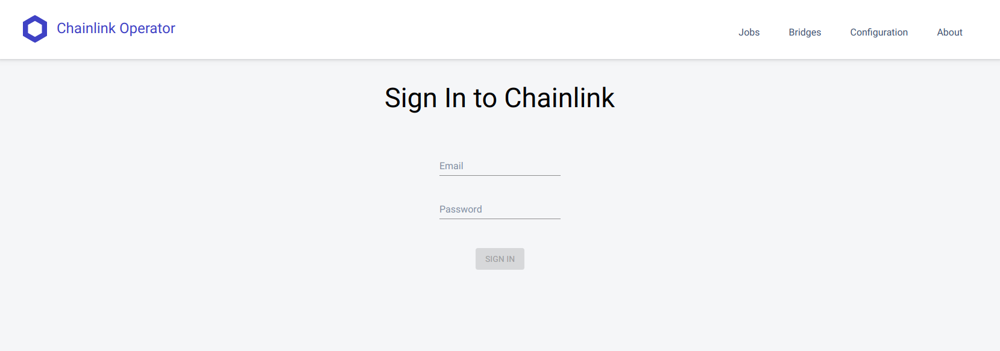

# Chainlink节点搭建教程（docker版）

本文我会给大家介绍，如何从零开始，在一个全新的Ubuntu系统上，搭建起Chainlink**测试**节点的过程。本文内容非常的基础，如果你已经非常熟悉Chainlink，或者的开发运维高手，无需阅读本文。本文所说的内容仅适用于测试环境，正式环境的部署请参考官方文档，或咨询Chainlink官方技术人员。

我们使用docker来建立Ethereum Client节点和Chainlink节点。使用docker的好处就是省去了编译工作，编译需要建立相对复杂的开发环境，可能还需要解决一些编译错误，比较费时费力。好在无论是Ethereum还是Chainlink，官方都会及时提供最新的release版本的镜像，我们直接拿来用就可以了。

# 安装docker

首先需要安装[docker](https://www.docker.com/)，大家可以在[这个](https://docs.docker.com/install/)页面根据自己操作系统的情况来按照文档完成安装。下面我写一下Ubuntu1804环境下的安装步骤。（[参考](https://docs.docker.com/install/linux/docker-ce/ubuntu/)）

依次执行下面的命令

安装必要的包

    sudo apt update
    sudo apt-get install \
        apt-transport-https \
        ca-certificates \
        curl \
        gnupg-agent \
        software-properties-common

安装docker官方提供的GPG key

    curl -fsSL https://download.docker.com/linux/ubuntu/gpg | sudo apt-key add -

此时可以验证一下可以的正确性，输入下面的命令，如果出现的是这一串字符`9DC8 5822 9FC7 DD38 854A  E2D8 8D81 803C 0EBF CD88`，说明正确。

    sudo apt-key fingerprint 0EBFCD88
        
    pub   rsa4096 2017-02-22 [SCEA]
          9DC8 5822 9FC7 DD38 854A  E2D8 8D81 803C 0EBF CD88
    uid           [ unknown] Docker Release (CE deb) <docker@docker.com>
    sub   rsa4096 2017-02-22 [S]

将稳定版本的docker添加到apt库中

    sudo add-apt-repository \
       "deb [arch=amd64] https://download.docker.com/linux/ubuntu \
       $(lsb_release -cs) \
       stable"

开始安装

    sudo apt update
    sudo apt install docker-ce docker-ce-cli containerd.io

这个过程可能会花费一些时间。完成后我们就完成了docker的安装了，你可以输入`docker -v`，如果有正确的输出，就说明安装成功。

# 建立Ethereum Client(Geth)节点

我们使用docker来运行起一个同步模式为light的Geth节点，网络选择测试网络Ropsten。Parity节点参考文档[https://docs.chain.link/docs/run-an-ethereum-client#section-parity](https://docs.chain.link/docs/run-an-ethereum-client#section-parity)

## 获取最新版本的Geth Docker镜像

    docker pull ethereum/client-go:latest

注：如果遇到权限问题，可以通过下面的命令，将当前用户添加到docker用户组

    sudo usermod -a -G docker $USER
    newgrp - docker

或者直接在拉取镜像的命令前加`sudo`。

## 创建Ethereum数据目录

    mkdir ~/.geth-ropsten

## 运行Ethereum容器

    docker run --name eth -p 8546:8546 -v ~/.geth-ropsten:/geth -it \
               ethereum/client-go --syncmode light --testnet --ws --ipcdisable \
               --wsaddr 0.0.0.0 --wsorigins="*" --datadir /geth

启动之后可以通过`Ctrl+P` 和 `Ctrl+Q` 来与docker的环境分离(detach)。

再次启动的话直接输入`docker start eth`就可以了。其中`eth`是刚刚启动命令中`—-name`中指定的容器名。

# 运行Chainlink节点

## 创建Chainlink测试目录

    mkdir ~/.chainlink-ropsten

## 创建环境变量文件

    echo "ROOT=/chainlink
    LOG_LEVEL=debug
    ETH_CHAIN_ID=3
    MIN_OUTGOING_CONFIRMATIONS=2
    MIN_INCOMING_CONFIRMATIONS=0
    LINK_CONTRACT_ADDRESS=0x20fe562d797a42dcb3399062ae9546cd06f63280
    CHAINLINK_TLS_PORT=0
    SECURE_COOKIES=false
    ALLOW_ORIGINS=*" > ~/.chainlink-ropsten/.env

其中

`ETH_CHAIN_ID=3`表示Chainlink需要接入Ethereum的Ropsten测试网络。

`LINK_CONTRACT_ADDRESS`填入的是Ropsten测试网络上的LINK token合约地址，这个地址在不同的网络上是不同的。如果您使用的不是Ropsten测试网络，需要前往Chainlink官方文档查询对应的合约地址。

由于Chainlink需要监听以太坊网络上的状态变化，所以需要充以太坊节点获取最新的区块信息。Chainlink与以太坊节点通过WebSocket进行通信。所以接下来需要获取Ethereum节点的地址。

如果以太的客户端节点容易与Chainlink的节点运行在同一台主机上，可以通过下面的命令获取到以太坊节点地址。

    ETH_CONTAINER_IP=$(docker inspect --format '{{ .NetworkSettings.IPAddress }}' $(docker ps -f name=eth -q))

然后将以太坊的地址写入到Chainlink的环境变量文件中：

    echo "ETH_URL=ws://$ETH_CONTAINER_IP:8546" >> ~/.chainlink-ropsten/.env

其中8546是以太坊节点默认的WebSocket监听端口，确保不要连接成REST或其他端口。

如果以太坊节点和Chainlink节点不再同一台机器上，请获取到以太坊所在机器的IP地址，并确保以太坊所监听的WebSocket端口开放。

## 运行Chainlink容器

    cd ~/.chainlink-ropsten && docker run --name chainlink -p 6688:6688 -v ~/.chainlink-ropsten:/chainlink -it --env-file=.env smartcontract/chainlink local n

首次启动的时候会要求两个密码，第一个输入的是节点钱包的密码，可以用来解锁节点自动生成的keystore。输入之后还需确认一次。第二个密码是一个账户和密码对，是GUI界面的登录密码和API的调用密码。

这两个密码和账号请务必牢记，如果丢失可能需要重新建节点。

你还可以把账号和密码写到环境变量的配置文件里，防止在终端输入时的拼写错误。参见：

[Miscellaneous](https://docs.chain.link/docs/miscellaneous#section-use-password-and-api-files-on-startup)

同样，启动之后可以通过`Ctrl+P` 和 `Ctrl+Q` 来与docker的环境分离(detach)，再次启动时输入`docker start chainlink` 即可。此时建议您将节点密码配置到文件中以方便使用。

不出意外的话你的第一个Chainlink节点就搭建完成啦。你可以通过在浏览器中输入节点ip:6688来访问节点管理界面了。

